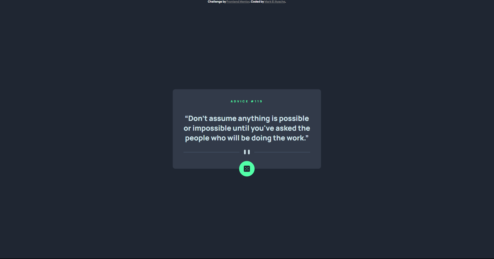

# Frontend Mentor - Advice generator app solution

This is a solution to the [Advice generator app challenge on Frontend Mentor](https://www.frontendmentor.io/challenges/advice-generator-app-QdUG-13db). Frontend Mentor challenges help you improve your coding skills by building realistic projects.

## Table of contents

- [Overview](#overview)
  - [Screenshot](#screenshot)
  - [Links](#links)
- [Author](#author)

## Overview

### The challenge

Users should be able to:

- View the optimal layout for the app depending on their device's screen size
- See hover states for all interactive elements on the page
- Generate a new piece of advice by clicking the dice icon
- Using API GET requests to display an [advice](https://api.adviceslip.com)

### Screenshot

### Links

- Solution URL: [Here](https://mark-elayache.github.io/Frontend-Mentor/Newbie/(D)%20Advice%20Generator%20App/index.html)

## Author

- LinkedIn - [mark-elayache](https://www.linkedin.com/in/mark-elayache)
- Frontend Mentor - [@mark-elayache](https://www.frontendmentor.io/profile/mark-elayache)