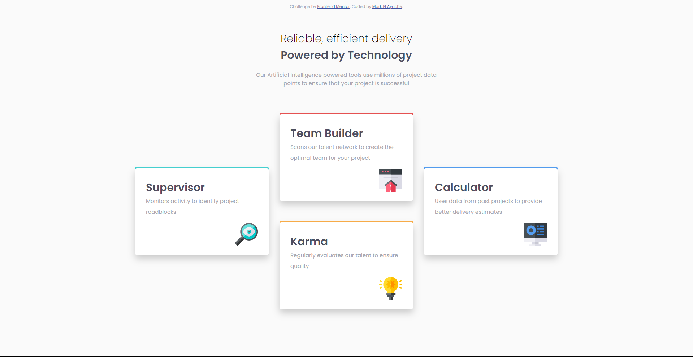

# Frontend Mentor - Four card feature section solution

This is a solution to the [Four card feature section challenge on Frontend Mentor](https://www.frontendmentor.io/challenges/four-card-feature-section-weK1eFYK). Frontend Mentor challenges help you improve your coding skills by building realistic projects. 

## Table of contents

- [Overview](#overview)
  - [Screenshot](#screenshot)
  - [Links](#links)
- [Author](#author)

## Overview

### The challenge

Users should be able to:

- View the optimal layout for the site depending on their device's screen size

### Screenshot

### Links

- Solution URL: [Here](https://mark-elayache.github.io/Frontend-Mentor/Newbie/(D)%20Four%20Card%20Feature/index.html)

## Author

- LinkedIn - [mark-elayache](https://www.linkedin.com/in/mark-elayache)
- Frontend Mentor - [@mark-elayache](https://www.frontendmentor.io/profile/mark-elayache)
